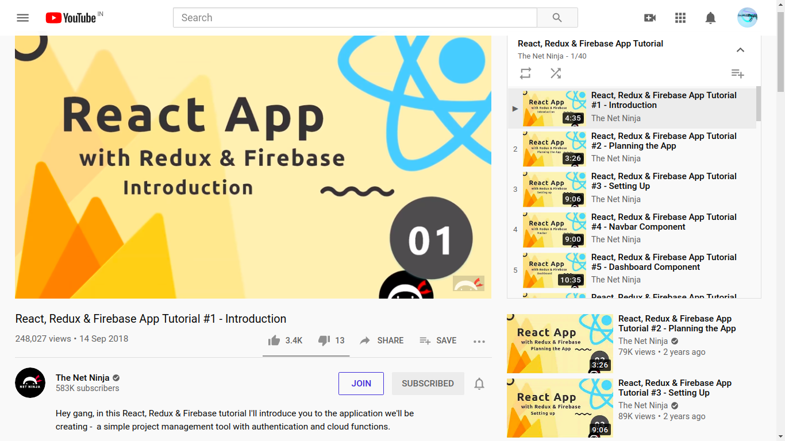
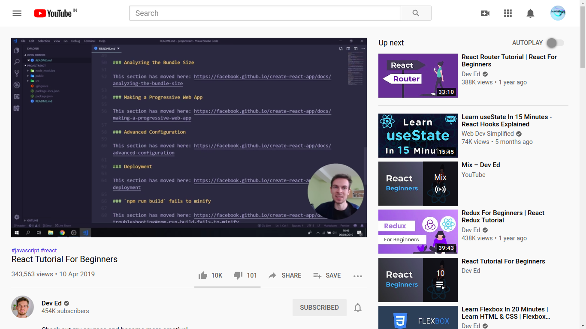

<h1 align="center"><b> React :ocean:</b></h1>

For intermediate and Experienced individuals it is better to start reading Documentation to get a quick grasp of the technology 

For the veterans :bearded_person: 	:point_down:

📃 Documentation is [here](https://reactjs.org/docs/getting-started.html) :fire:

<ins><h2> Cool links :sunglasses: </h2></ins>
These links are helpful for learning React

<h3>Video Tutorials :film_projector: </h3>

* **Net Ninja** - known for his web development series on youtube make sure to definitely check out first if you are a beginner
  * [React + Redux + Firebase](https://www.youtube.com/watch?v=Oi4v5uxTY5o&list=PL4cUxeGkcC9iWstfXntcj8f-dFZ4UtlN3) - 263 mins
  
  

* **Traversy Media** - Crash Course
  * [React Crash Course](https://www.youtube.com/watch?v=sBws8MSXN7A) - 60 mins
  
  

* **Dev Ed** - known for his humorous method of teaching try him out
  * [Intro to React](https://www.youtube.com/watch?v=dGcsHMXbSOA) - 60 mins
  

  
* **SimpleTut** - [React + Node.js](https://www.youtue.com/watch?v=nusgoj74a3Y) - 50 mins
 

<h3><b>Blogs to Follow :open_book:</b> </h3>

* [5 part React starter kit tutorial](https://blog.glitch.com/post/react-starter-kit)
* [The Beginner's Guide to React](https://egghead.io/courses/the-beginner-s-guide-to-react)
* [Intro to React testing library](https://kentcdodds.com/blog/introducing-the-react-testing-library)
* [Misc Projects and Components](https://overreacted.io/)
* [Updates and News](https://dev.to/)